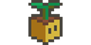

# Pet Plant

I present to you Pet Plant 🌱🎮

A Decentralized-AI-Powered Play-to-Earn IoT and Blockchain GameFi Tamagochi Featuring a Points System and RWA

The most over-engineered way to keep your tamagochi is built with ChasmNetwork and Chromia Blockchain

Half the code is AI-generated. The only human touch? Building the circuit board. Welcome to the future of plant parenting!

## How it works?

Pet Plant starts you off with a virtual plant. You earn points by watering your digital greenery, and as you accumulate points, your plant evolves through different phases, each accompanied by a unique short story. Behind the scenes, these stories are dynamically generated using the Chasm Orchestrator LLM API, adding an element of surprise and creativity to each phase. All game data, including your plant's status and story progression, is securely stored on the Chromia Blockchain, ensuring transparency and permanence in your plant's digital journey.

## Stack
- OpenAI SDK with Chasm Network API
- Chromia Blockchain
- Johnny Five